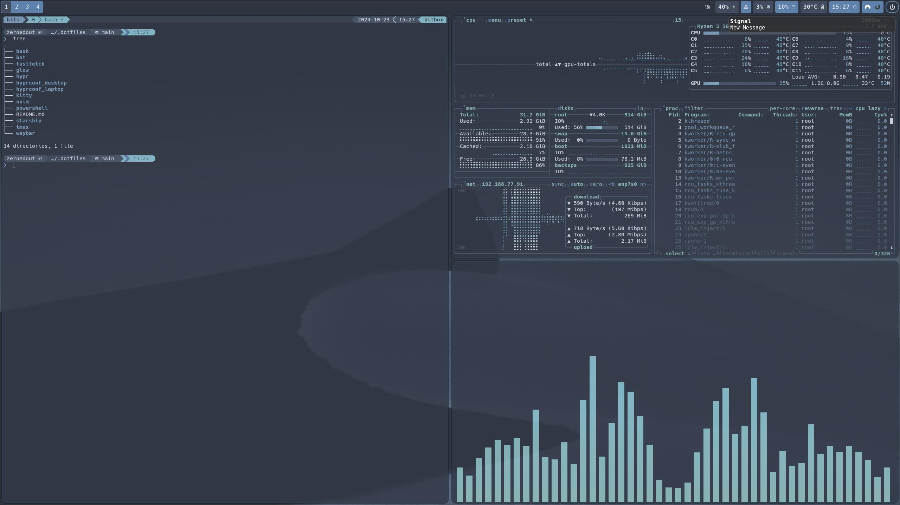

# Dotfiles
This is mostly for my own reference so if you're here, use at your own risk.  
# Installation
Create a directory named `.dotfiles` in the $HOME directory.
Make sure git and stow are installed.  If leveraging dotfiles for other things (like starship and Powershell) make sure these packages are installed as well.
Initialize git inside `.dotfiles` and pull down the repo.
  
Run `stow` to create the symlinks for your various dot configs:
```
stow nvim
stow bash
stow powershell
stow starship
```
For bash you may need to delete the existing .bashrc or use the parameter to overwrite the existing one with a symlink.

need to have neovim installed, with a version above v8.0 and then the Lazy-vim config will take care of downloading all of the plugins, and the configuration will be handled by the .lua files

# hyprland  
  

For hyprland make sure to have the following packages installed:  
pacman  
  hyprland, swaync, hyprlock, waybar, hyprpaper, hypridle, xdg-desktop-portal-hyprland, ttf-font-awesome

aur  
  hyprshot, pwvucontrol, ulauncher
everything is Nord themed where possible.  The reason for the separate hyprconf directories as an attempt to maintain one git repo for hyprland config but utilize it on a desktop and a laptop.  This seems to work well for me, your mileage may vary.  
